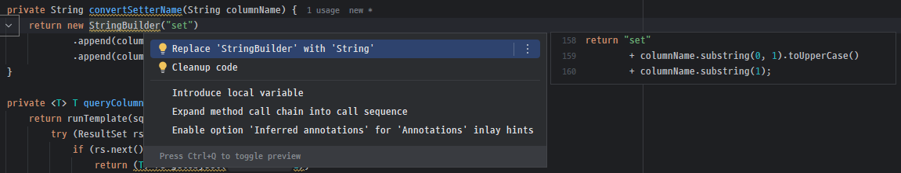
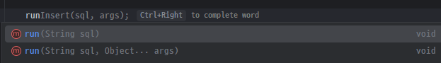

## 🎯 과제 목표

- 순수 **JDBC**로 경량 DB 유틸리티(**SimpleDb**)를 구현한다.
- **멀티스레드 환경**(예: Spring WebMVC)에서 안전하게 동작하는 **커넥션 관리**를 설계한다.
- **트랜잭션(Commit/Rollback)**, **SQL 빌더**, **DTO/엔티티 매핑** 등 핵심 기능을 스스로 설계/구현한다.
- 제공된 **단위 테스트(SimpleDbTest)** 전 항목 `통과(✅ t001~t019)`를 최종 목표로 한다.

## 🧩 요구사항 정리

## A. 스레드·커넥션 관리 - TODO
- `SimpleDb` **인스턴스 1개**를 여러 스레드에서 **동시에 공유**해도 안전해야 함.
- **각 스레드는 독립적인 Connection 1개**를 사용한다.
- `simpleDb.close()` 호출 전까지 **스레드별 Connection은 유지**되어야 함.
- 구현 힌트: `ThreadLocal<Connection>` 또는 `Map<ThreadId, Connection>` + 동기화 정책.

## B. SQL 빌더(`Sql`) 기능
- `append(...)`/`appendIn(...)`을 통해 **가변 파라미터 바인딩** 및 **IN 절**을 안전하게 생성.
- 주요 실행 메서드
  - `insert()` → 생성된 **Auto Increment PK** 반환
  - `update()`, `delete()` → 영향 행 수 반환
  - 단일 값 조회: `selectLong()`, `selectString()`, `selectBoolean()`, `selectDatetime()`
  - 다중/단일 행 조회: `selectRows()`, `selectRow()`
  - 매핑 조회: `selectRows(Class<T>)`, `selectRow(Class<T>)`
- LIKE / BETWEEN / ORDER BY FIELD / LIMIT 등 조합을 **문자열 안전성**(바인딩) 유지하며 구성

## C. 트랜잭션 API - TODO
- `startTransaction()` → autoCommit=false 설정 및 트랜잭션 시작
- `commit()` / `rollback()` → 현재 스레드의 Connection 트랜잭션 제어
- 트랜잭션 경계 간 일관성 보장 (동일 스레드 내 같은 Connection 재사용)

## D. 로깅/디버그
- `setDevMode(true)`일 때 **raw SQL & 바인딩 값**을 확인 가능한 수준의 로그 출력 권장

---

## ✅ 테스트 통과 기준(요약)

- **CRUD**: `t001 insert`, `t002 update`, `t003 delete`
- **조회**: `t004 selectRows`, `t005 selectRow`, `t006 NOW()`, `t007 selectLong`, `t008 selectString`, `t009~t011 selectBoolean`
- **쿼리 도우미**: `t012 LIKE`, `t013 appendIn`, `t014 ORDER BY FIELD`, `t015~t016 DTO 매핑(Article)`
- **동시성**: `t017 multi threading` (10개 스레드 동시 조회 성공 및 **스레드별 커넥션 사용** 확인)
- **트랜잭션**: `t018 rollback`, `t019 commit`

## 기타
- 구현 과정에서 **어려웠던 점**과 **느낀 점**을 간단히 정리해주세요 (README.md 필수 항목)
- 원활한 코드 리뷰를 위해 **문제 해결 과정**을 아래 방법 중 최소 한 가지 방식으로 남겨주세요 (간단하게라도)
  - PR 문서
  - 리드미
  - 코드에 간단한 주석 추가


---
# 📚 사전 학습 및 구현 중 학습
## JDBC
> Java DataBase Connectivity. 자바에서 데이터베이스에 접속할 수 있도록 하는 자바 API.
> JDBC는 데이터베이스에서 자료를 쿼리하거나 업데이트 하는 방법을 제공한다.

JDBC의 3가지 기능. 각 DB의 JDBC 드라이버는 JDBC 인터페이스를 구현한 구현체이다.
`Connection` : 연결
`Statement` : SQL을 담은 내용
`ResultSet` : SQL 요청 응답

JDBC에 의해 에플리케이션 로직은 JDBC API에 의존하게 되고, DB의 변경이 이루어져도 어플리케이션 서버의 코드 변경을
'최소화' 할 수 있다.
- 단 DB마다 SQL, 데이터타입, 페이징 등의 일부 사용법이 다르기 때문에 JDBC 코드는 변경이 이루어지지 않더라도,
  SQL과 관련된 부분은 DB에 의존할 수 밖에 없다.

### SQLMapper, JPA

JDBC가 사용되는 부분을 추상화한 계층.

사용자는 JDBC를 사용해서 DB에 접근하여 SQL을 실행하고 결과를 가져오는 부분은 해당 기술에 맡기고, 다른 코드를 작성하면 된다.

SQLMapper에는 대표적으로 JdbcTempalte과 MyBatis가 있다.

마찬가지로, 구현해야 할 `SimpleDb`는 JDBC 접근 부분을 JDBC 인터페이스를 이용하여 내부적으로 추상화하고

커넥션, 로깅, 내부적으로 추상화하고 append, appendIn등을 이용해

SQL을 편리하게 작성하도록 돕는 유틸리티 객체이다.

## DriverManager

DriverManager의 getConnection으로 전달되는 URL은 `jdbc:드라이버명`으로 시작되는데,

이 URL 정보를 통해 라이브러리에 등록된 JDBC 구현체(DB 드라이버)중 적절한 구현체를 찾아 커넥션을 획득해 클라이언트에 반환한다.

이때, DriverManger는 매번 새로운 커넥션을 생성해 반환하므로, 요구사항 A를 해결하기 위해

Thread를 통한 커넥션 풀을 고려해야할 것이다.

## Slf4j 로그 레벨

로그를 남기기 위해 log.info, log.trace를 작성하는데, sql에는 log.info를 바인딩 매개변수들은 log.trace를

인텔리제이가 자동완성으로 추천해주었다.

이것이 적절한 자동완성인지 확인하고자 했다.

logger의 레벨은 기본적으로 (낮음) trace , debug, info, warn, error (높음) 로 되어있고,

info 레벨에선 info, warn, error수준의 log가 출력되고

debug 레벨에선 debug, info, warn, error수준의 에러가 호출 되는 식이다.

로그 레벨은 info가 default로 설정되어 있는데 IDE가 프로그램의 큰 움직임, 비즈니스 로직 수행의 핵심인 SQL 실행은 info 레벨로

개발 / 디버깅에만 필요한 민감한 정보이며 데이터양이 많은 바인딩 값은 trace 레벨로 추천한 것이다.

### 런타임 로깅 레벨 변경
devMode 설정으로 동적으로 로그 레벨을 변화시키려고 하였지만,

Logger인터페이스에는 setLevel이 지원되지 않는다.

@Slf4j는 인터페이스 역할을 하는 파사드, Logback이 Slf4j를 실제 구현한 구현체라고 한다.

Logback 구현체에는 인터페이스 메소드 뿐만 아니라 다양한 추가 메소드들을 지원하고 여기에 setLevel도 포함된다.

따라서, Logback(ch.qos.logback.classic.Logger)의 Logger를 import하면 setLevel을 이용해 동적으로 로깅레벨을 수정할 수 있다.

## 🚀 트러블 슈팅
### callback함수와 템플릿 메소드 패턴을 이용한 반복 코드 제거 (1차)

sql을 실행시키는 run 메소드에서 getConnection -> prepareStatement 바인딩 -> resultSet반환이 반복되었다.

따라서 다음과 같이 callback 함수를 감싸는 runTemplate 메소드를 구현하였다.

```java
private <T> T runTemplate(String sql, Object[] args, Function<Statement, T> callback) {
  try (Connection connection = getConnection();
       PreparedStatement statement = connection.prepareStatement(sql, Statement.RETURN_GENERATED_KEYS)) {

    // 바인딩할 값이 없을 경우 생략
    if (args != null) {
      for (int i = 0; i < args.length; i++) {
        statement.setObject(i + 1, args[i]);
      }
    }

    return callback.apply(statement);

  } catch (SQLException e) {
    throw new RuntimeException(e);
  }
}

// !! 컴파일에러 !! runTemplate에서 try - catch로 콜백 메소드를 감싸고 있기 때문에
// executeUpdate throws SqlException로 인한 컴파일 에러를 피하기 위해 의미 없는 try - catch 구문이 필요
public void run(String sql) {
  runTemplate(sql, statement -> statement.executeUpdate(sql));
}
```

### try - catch 제거를 위한 함수형 인터페이스 선언 (2차)
```java
// runTemplate의 Function<Statemen, T> callback을 대체하면
@FunctionalInterface
interface StatementCallback<T> {
  T apply(PreparedStatement statement) throws SQLException;
}

// 컴파일 에러가 발생하지 않는다!
public void run(String sql) {
  runTemplate(sql, statement -> statement.executeUpdate(sql));
}
```

### selectRows 처리에서 rs.next()중복 호출
selectRows를 while(resultSet.next())로 selectRow를 반복해 rows를 얻고자 하였다.

그러나, 내부적으로 selectRow가 if(resultSet.next())를 호출하여 커서가 2번씩 이동하는 문제가 발생하였다.

```java
List<...> selectRows() {
  while (resultSet.next()) {
    selectRow호출 -> selectRow내부에 if(resultSet.next) 존재;
    1번의 while 순회에 resultSet.next()가 두번씩 호출 되며 cursor가 2개씩 이동한다.
  }
```

selectRow 외부에서 if(resultSet.next())를 미리 호출하고 rs를 다룸으로써 문제를 해결하였다.

### setObject()와 getObject()에서 Boolean만이 제대로 변환되지 않는 이유 (t9 ~ t11)

MySql에서는 boolean타입이 없이 tinyInt(1) 타입으로 true는 1 false는 0으로 관리한다.

따라서 rs.getObject(1)을 호출했을 때는, 1이나 0이 호출 되어 Boolean으로 캐스팅 되지 않고 ClassCastExcpetion이 발생한 것이다.

### 현재 코드에서 selectDateTime, selectLong 등을 위해 setDateTime, setLong등을 호출하는 runTemplate을 일일이 다시 작성해야 할까?

MySql에서 반드시 따로 관리해줘야 하는 boolean과 다르게 다른 코드들은 굳이 따로 작성할 필요가 없다.

타입 안정성과 약간의 성능 최적화 VS 코드 간결성, 실용성의 trade-off로 보면 된다.

<details>
<summary> AI의 질문에 대한 답변 </summary>
이 문제는 타입 안전성(Type Safety) vs. 코드 간결성(Conciseness)이라는 두 가지 가치 사이의 균형에 관한 것입니다. 
결론부터 말씀드리면, 지금처럼 setObject/getObject를 사용하고 특정 케이스(boolean)에만 별도의 메서드를 만드는 방식이 매우 좋은 해결책입니다.

### `setObject` / `getObject`를 계속 사용하는 이유

1.  **코드 간결성**: `setObject`와 `getObject`는 모든 데이터 타입을 처리할 수 있어 코드를 매우 간결하게 만듭니다. 
`selectLong()`, `selectString()` 등 각 타입별로 **반복적인 `runTemplate` 코드를 작성할 필요가 없습니다.**
2.  **실용적인 해결책**: `setObject`는 대부분의 경우 잘 작동합니다. `boolean`과 같이 문제가 발생하는 예외적인 경우에만
`queryBooleanColumn()`과 같은 특정 메서드를 추가하면 됩니다. 이는 불필요한 코드 중복을 피하면서도 문제를 해결하는 실용적인 방법입니다.

---

### `setInt`/`getLong` 등을 사용했을 때의 장점

1.  **강력한 타입 안전성**: `setInt()`를 사용하면 컴파일러가 `int` 타입만 받도록 강제하기 때문에, 
개발자가 실수로 다른 타입의 값을 넘기는 것을 막을 수 있습니다. 이는 런타임에 발생할 수 있는 `ClassCastException` 같은 오류를 줄여줍니다.
2.  **미세한 성능 최적화**: `setObject()`는 내부적으로 객체의 타입을 확인하는 과정이 필요하지만, 
`setInt()`는 이미 타입이 정해져 있어 이 과정이 생략됩니다. 이는 미세하지만, 대량의 데이터를 처리할 때 성능 차이를 만들 수 있습니다.

### 결론

현재 당신의 코드는 **실용적인 관점에서 가장 효율적인 균형점**을 찾았습니다. 일반적인 `selectRow()`, `selectRows()`와 같은 메서드에서는 
`setObject`/`getObject`를 사용해 유연성을 확보하고, 타입 문제(boolean)가 발생하는 예외적인 경우에만 전용 메서드를 만들어 문제를 해결했습니다. 
이 방식은 코드의 양을 최소화하면서도 안정성을 확보하는 현명한 접근입니다. 굳이 `setLong`, `setString` 등을 일일이 구현할 필요는 없습니다.
</details>

---

# 2주차 트러블 슈팅
## StringBuilder 대신 "+"를 이용해서 문자열을 겹합해도 좋을까?



기껏 StringBuilder를 이용하여 결합하였더니 IDE가 +를 이용해서 결합하는 것을 추천하였다.

JAVA 9부터는 + 로 String을 결합하면 알아서 컴파일러가 StringBuilder로 최적화해준다고 한다.

단, 지속적으로 초기화가 발생하는 경우는 StringBuilder를 사용하는 것이 좋고, 단순 결합의 경우에는 + 로 충분한 것 같다.

```java
// 이건 여전히 비효율적
String result = "";
for (String s : list) {
    result += s;  // 매번 새 객체 생성
}

// 이렇게 해야 함
StringBuilder sb = new StringBuilder();
for (String s : list) {
    sb.append(s);
}
```

## lombok의 boolean setter 명명법

boolean isXXX 로 boolean값을 설정하면

getter는 isXXX, setter는 setXXX로 선언한다.

## boolean은 특별 취급이 아님? -> method.invoke()의 숨겨진 기능

Article정보를 리플렉션으로 받아 값들을 바인딩 할 떄, boolean필드인 isBlind를 따로 처리하지 않아도 예외가 발생하지 않았다.

왜 분명 앞의 t10, t11에선 boolean을 따로 취급해줘야 하는데 왜일까?

-> 리플렉션의 method.invoke()에서 Integer(0), Integer(1) 값이 boolean 값으로 캐스팅된다.

## connetion.close() 미작동 문제

t17에서 스레드별 커넥션 획득 및 커밋은 정상 작동하는데 10초의 대기시간이 걸릴 때까지 테스트코드가 대기하는 문제가 발생했다.

```java
public void close() {
  try {
    Connection connection = connectionHolder.get();
    log.debug("커넥션 종료 시도 {}", connection);
    connection.close();
    log.debug("커넥션 종료 {}", connection);
  } catch (SQLException e) {
    throw new RuntimeException(e);
  } finally {
    connectionHolder.remove();
  }
}
```

다음과 같이 로그를 넣어 close()호출 전에 이미 connection이 null로 닫혀있는 상태라는 것을 확인할 수 있었다.

디버깅 결과 simpleDb자체의 로직보다는 t17과 다른 테스트코드와의 함수호출 차이 때문인 것을 알았다.

t17만이 close()를 호출하는데, 다른 테스트 코드는 close()를 직접 호출하지 않는다.

하지만 내부적으로는 autoCommit모드에서는 close()를 직접 호출하지 않아도 simpleDb.close()를 호출하도록 하였기 때문에

직접 autoCommit모드에서 close()를 다시한번 호출한 t17에서 connection이 이미 null인 상태로 제대로 반환되지 않아 발생한 문제였다.

- 여기에 Exception e로 처리했던(수정함) `queryRows`때문에 nullPointerException도 무시되어 디버깅이 오래걸렸다.

어찌됐든 요구사항에서는 simpleDb.close()호출전까지 커넥션을 닫지 말라고 명시되어있지만,

t17이 아닌 다른 코드에서 명시적으로 close()를 호출 하지 않는다고 해서 

내부적으로 close()를 호출하지 않는 것은 그것대로 문제라고 생각하기 때문에 다음과 같은 

null을 가드하는 if문을 추가하였다. 

```java
import java.sql.SQLException;

public void close() {
  try {
    Connection connection = connectionHolder.get();

    if (connection == null) {
      log.warn("connection 이미 종료됨");
      return;
    }

    log.debug("커넥션 종료 시도 {}", connection);
    connection.close();
    log.debug("커넥션 종료 {}", connection);
  } catch (SQLException e) {
    throw new RuntimeException(e);
  } finally {
    connectionHolder.remove();
  }
}
```

# 고민한 점
## run과 appendIn의 오버로딩



`run(String sql, Object... args)`는 만약 매개변수가 1개만 전달되었을 때, 

JAVA의 가변인자 내부처리로 run(String sql, new Object[0])와 같이 전달되어 잘 실행된다.

또한, 가변인자를 선언한 메소드를 작성한 개발자는 가변인자에 아무것도 전달되지 않더라도 문제가 없도록

구현을 하였을 것이다.

하지만 이 메소드를 사용하는 사용자의 입장에서 이 메소드가 정말 `Select * from Article`과 같이 String sql만 전달해서

사용될 수 있는 메소드인지 걱정할 수 있다고 생각했고

이로 인해 내부코드를 살펴보게 만든다거나 방어적 프로그래밍을 해야한다면 이는 좋지 않은 사용자 경험이라고 생각했다.

따라서 가변인자에 대해 잘 모르더라도 IDE의 지원을 통해 매개변수 1개인 `run`이나 `appendIn`을 발견해

args에 아무것도 전달하지 않아도 사용할 수 있는 메소드라는 것을 적극적으로 표현하고자 하였다.

## devMode 필드 선언

현재 devMode는 필드로 선언되어 있지 않다.

이는 devMode의 상태를 simpleDb가 따로 필드로 선언하여 유지할 필요가 없다고 생각했기 때문이다.

왜냐하면 이 코드는 로그 출력이 온전히 logger를 통해서 이루어지고 있으며 

setDevMode()에 의해 logger의 레벨 수준을 동적으로 제어하도록 구현하였기 때문에 devMode는 온전히 이 logger를 위한 상태이다.

따라서, setDevMode에 의해 logger의 상태가 변경되고 logger가 이를 갖고 있다면

굳이 simpleDb가 devMode 상태를 관리할 이유는 없다고 생각했다.

### devMode(boolean) VS devMode()

사실 이 경우 필드를 제어하지 않는 느낌을 주기 위해 테스트코드에서 제시해준 setDevMode(true)대신 setDevMode()로

매개변수가 없이 선언된다면 더 좋을 것 같다고 생각하기도 했으나, 

사용자 입장에선 또 `setProdMode()`와 같이 setXXXMode 메소드를 찾아야한다는 점에서 장단점이 존재하는 것 같다.

devMode이거나 아니거나인 지금의 상황에서는 현재의 메소드 선언이 가장 좋아보인다.

## 단일먼저 구현 VS 다수부터 구현

일반적으로 단일 로직을 먼저 구현하는 쪽을 항상 택해왔던 것 같다.

하지만 이번에는 다수 로직을 먼저 구현하는 쪽을 택했는데, 이는 아무래도 rs.next()의 동작이 가장 컸던 것 같다.

while(rs.next())를 호출하며 단일 로직 내부에 숨어있는 if(rs.next())를 호출되어 커서가 2번씩 이동한다거나,

다수를 구현하는 부분의 들여쓰기 레벨이 그렇게 크지 않아 가독성이 괜찮았다는 점이 굉장히 주효했던 것 같다.

앞으로도 단일부터 구현하는 쪽을 주로 사용하겠지만, 이렇게 다수부터 구현하는 쪽도 무시할만한 오버헤드만 있고

압도적인 작성편의성이 있다면 고려해볼 수 있을 것 같다.